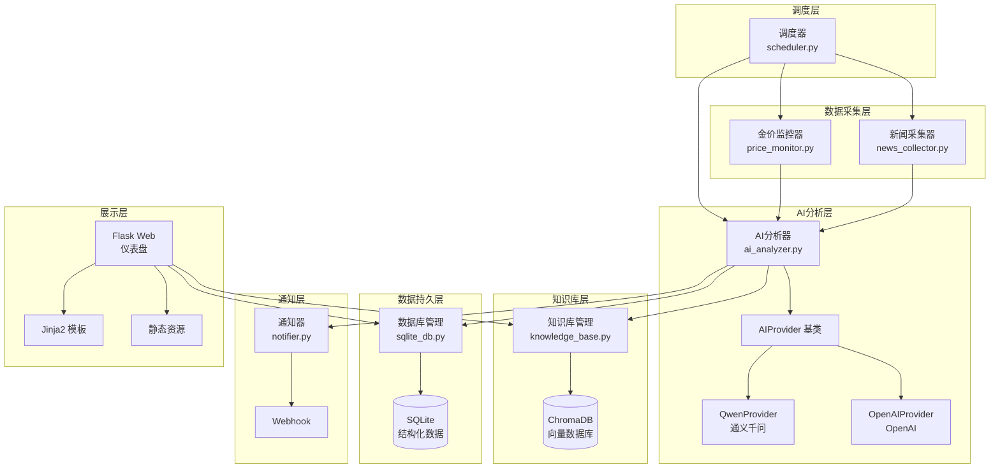
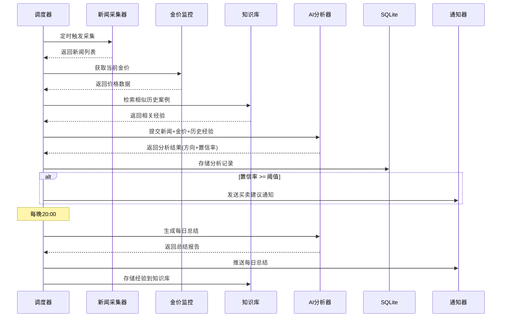

## 用户需求

构建一个黄金涨幅盯盘软件（Gold Monitor），用于自动化监控黄金市场动态并提供智能买卖建议。

## 产品概述

一个基于 Python 的黄金市场智能监控与分析系统。系统从多个新闻源采集信息，结合实时金价数据，通过 AI 大模型进行智能分析，生成带有置信率的买卖建议，并通过 Webhook 通知用户。系统具备知识库学习能力，可根据用户反馈持续优化判断准确性。提供 Web 仪表盘供用户查看实时数据、历史分析和系统状态。

## 核心功能

1. **新闻采集**：从多个财经新闻网站（如新浪财经、金十数据等）自动采集与黄金相关的新闻信息
2. **AI 智能分析**：对采集到的新闻进行利好/利空分析，生成置信率评分；AI 接入层采用策略模式，支持切换不同大模型（默认通义千问）
3. **金价监控**：实时监控黄金价格涨跌幅，结合价格技术指标增强 AI 分析判断
4. **智能通知**：当置信率达到阈值时，通过 Webhook 向用户推送买入/卖出建议
5. **每日总结**：每天晚上 8 点自动生成 24 小时内影响黄金波动的事件总结、分析报告及购买建议有效性回顾
6. **知识库学习**：接收用户反馈，将经验积累到向量知识库中，后续分析时检索相似案例辅助决策
7. **Web 仪表盘**：展示实时金价、分析结果、历史记录、系统状态等信息

## 技术栈

- **语言**：Python 3.10+
- **Web 框架**：Flask（轻量级 Web 仪表盘）
- **AI 接入**：通义千问（阿里云 DashScope API），策略模式支持切换 OpenAI/其他模型
- **数据库**：SQLite（结构化数据持久化）+ ChromaDB（向量知识库）
- **定时调度**：APScheduler
- **新闻采集**：requests + BeautifulSoup / feedparser（RSS）
- **模板引擎**：Jinja2（Flask 内置）
- **前端**：原生 HTML/CSS/JS（轻量仪表盘，无需前端框架）
- **配置管理**：YAML + python-dotenv
- **容器化**：Docker

## 实现方案

### 整体策略

采用分层模块化架构，将系统拆分为数据采集层、AI 分析层、知识库层、通知层、调度层和展示层。各层通过明确的接口通信，核心模块通过调度器统一编排。AI 接入层使用策略模式（Strategy Pattern），定义统一的 `AIProvider` 抽象基类，不同大模型实现具体策略类，通过配置文件切换。

### 关键技术决策

1. **AI 策略模式设计**：定义 `AIProvider` 抽象基类，包含 `analyze_news()`、`generate_summary()` 等方法。`QwenProvider`（通义千问）为默认实现，预留 `OpenAIProvider` 等扩展点。通过 `config.yaml` 中的 `ai.provider` 字段切换。选择此方案而非简单 if-else 是因为后续可能接入多个模型，策略模式更符合开闭原则。

2. **知识库方案**：使用 ChromaDB 作为向量数据库存储分析经验和用户反馈。每次 AI 分析前，先从知识库中检索相似场景作为上下文注入 prompt，实现经验积累与迁移。ChromaDB 内嵌运行，无需额外部署。

3. **新闻采集策略**：采用多源采集 + 统一接口模式。为每个新闻源实现独立的采集器（collector），统一返回 `NewsItem` 数据结构。使用 RSS 优先策略（稳定性好），辅以网页爬取。设置采集频率限制避免被封。

4. **金价数据获取**：通过公开 API（如金十数据 API、Exchange Rates API）获取实时金价，缓存 5 分钟避免频繁请求。计算短期涨跌幅和波动率作为 AI 分析的辅助输入。

5. **置信率与通知机制**：AI 分析输出结构化 JSON，包含 `direction`（利好/利空/中性）、`confidence`（0-100）、`reasoning`。当 confidence >= 配置阈值（默认 70）时触发 Webhook 通知。支持多个 Webhook 地址。

6. **每日总结**：APScheduler 在每晚 20:00 触发，汇总当日所有新闻分析、金价变动，调用 AI 生成综合报告，对比当日建议与实际走势，评估准确率。

### 系统架构



### 数据流



## 实现注意事项

1. **错误处理与容错**：新闻采集需处理网络超时、页面变更等异常，单个源失败不影响整体流程；AI 接口调用需设置重试机制（最多 3 次，指数退避）；金价 API 不可用时使用最近缓存数据。

2. **性能考量**：新闻采集使用 `concurrent.futures.ThreadPoolExecutor` 并行执行多源采集；ChromaDB 查询限制返回 top-5 相似结果避免上下文过长；SQLite 使用 WAL 模式支持并发读。

3. **安全性**：所有 API Key 通过 `.env` 文件管理，不硬编码；Webhook URL 同样存储在环境变量中；Web 仪表盘为只读展示，无敏感操作。

4. **日志**：使用 Python 标准 `logging` 模块，按模块分级别记录；关键操作（AI 分析、通知发送）记录 INFO 级别；错误记录完整堆栈但不包含 API Key。

5. **向后兼容**：数据库表结构通过版本号管理，预留 schema 升级路径；配置文件使用 YAML 格式便于扩展新字段。

## 目录结构

```
gold-monitor/
├── main.py                      # [NEW] 应用入口文件。负责初始化所有模块、启动调度器和 Web 服务。解析命令行参数支持不同运行模式（完整模式/仅Web/仅调度）。
├── config.py                    # [NEW] 配置管理模块。加载 config.yaml 和 .env，提供全局配置单例。包含默认值定义、配置校验逻辑。
├── config.yaml                  # [NEW] 主配置文件。定义AI提供商选择、采集频率、置信率阈值、通知配置、数据库路径等所有可调参数。
├── .env.example                 # [NEW] 环境变量模板。列出所有需要的 API Key 和敏感配置项（DashScope API Key、Webhook URL等）。
├── requirements.txt             # [NEW] Python依赖清单。包含flask, apscheduler, requests, beautifulsoup4, feedparser, chromadb, dashscope, pyyaml, python-dotenv等。
├── Dockerfile                   # [NEW] Docker构建文件。基于python:3.10-slim，安装依赖，暴露Web端口，设置时区。
├── README.md                    # [NEW] 项目说明文档。包含项目介绍、架构图、部署步骤（本地/Docker）、配置说明、使用指南、API文档。
├── .gitignore                   # [NEW] Git忽略规则。忽略.env、__pycache__、数据库文件、ChromaDB数据目录等。
├── core/
│   ├── __init__.py              # [NEW] 核心模块初始化。导出所有核心类。
│   ├── ai_analyzer.py           # [NEW] AI分析器模块。定义AIProvider抽象基类（策略模式），实现QwenProvider和OpenAIProvider。AIAnalyzer类负责调用provider进行新闻分析、每日总结生成，输出结构化分析结果（方向、置信率、理由）。
│   ├── news_collector.py        # [NEW] 新闻采集模块。定义NewsSource抽象基类，实现SinaFinanceCollector、Jin10Collector等。NewsCollector类管理多个采集源，并行采集并去重，返回统一NewsItem列表。
│   ├── price_monitor.py         # [NEW] 金价监控模块。从公开API获取实时黄金价格，计算涨跌幅和波动率，提供价格缓存机制，支持历史价格查询。
│   ├── knowledge_base.py        # [NEW] 知识库管理模块。封装ChromaDB操作，提供经验存储（add_experience）和相似案例检索（search_similar）功能。管理用户反馈的存储和检索。
│   ├── notifier.py              # [NEW] 通知器模块。实现Webhook通知发送，支持多个Webhook地址，消息格式化（Markdown），发送失败重试，支持飞书/企业微信/钉钉Webhook格式。
│   └── scheduler.py             # [NEW] 调度器模块。基于APScheduler，编排新闻采集->AI分析->通知的完整流程。配置定时任务：新闻采集（每30分钟）、金价检查（每5分钟）、每日总结（每晚20:00）。
├── db/
│   ├── __init__.py              # [NEW] 数据库模块初始化。
│   ├── sqlite_db.py             # [NEW] SQLite数据库管理。定义表结构（news_items, analysis_results, price_history, daily_summaries, user_feedback），提供CRUD操作，支持schema版本管理。
│   └── chroma_db.py             # [NEW] ChromaDB封装。管理ChromaDB客户端初始化、集合创建、文档嵌入存储和相似度查询。
├── models/
│   ├── __init__.py              # [NEW] 模型模块初始化。
│   └── schemas.py               # [NEW] 数据模型定义。使用dataclass定义NewsItem, AnalysisResult, PriceData, DailySummary, UserFeedback等核心数据结构。
├── web/
│   ├── __init__.py              # [NEW] Web模块初始化。
│   ├── app.py                   # [NEW] Flask应用。定义路由：仪表盘首页(/)、历史记录(/history)、API接口(/api/feedback用于用户反馈、/api/status系统状态、/api/analysis最新分析)。
│   └── templates/
│       ├── base.html            # [NEW] 基础模板。定义页面骨架、导航栏、页脚，引入CSS/JS资源。
│       ├── dashboard.html       # [NEW] 仪表盘页面。展示实时金价、最新分析结果、置信率仪表盘、近期通知列表。
│       └── history.html         # [NEW] 历史记录页面。展示历史分析列表、每日总结、建议准确率统计。
├── static/
│   ├── css/
│   │   └── style.css            # [NEW] 全局样式。仪表盘布局、卡片样式、图表容器、响应式适配。
│   └── js/
│       └── app.js               # [NEW] 前端交互逻辑。实时数据刷新（轮询）、用户反馈提交、图表渲染。
└── tests/
    ├── __init__.py              # [NEW] 测试模块初始化。
    └── test_core.py             # [NEW] 核心模块单元测试。覆盖AI分析器策略切换、新闻采集解析、知识库检索、通知发送等关键逻辑。
```

## 关键代码结构

### AI Provider 策略模式接口

```python
from abc import ABC, abstractmethod
from dataclasses import dataclass
from typing import List, Optional

@dataclass
class AnalysisResult:
    """AI分析结果"""
    direction: str          # "bullish"(利好) / "bearish"(利空) / "neutral"(中性)
    confidence: float       # 置信率 0-100
    reasoning: str          # 分析理由
    suggested_action: str   # "buy" / "sell" / "hold"
    key_factors: List[str]  # 关键影响因素

class AIProvider(ABC):
    """AI提供商抽象基类（策略模式）"""

    @abstractmethod
    def analyze_news(
        self,
        news_items: List['NewsItem'],
        price_data: Optional['PriceData'] = None,
        historical_context: Optional[List[str]] = None
    ) -> AnalysisResult: ...

    @abstractmethod
    def generate_daily_summary(
        self,
        analyses: List[AnalysisResult],
        price_changes: List['PriceData'],
        news_items: List['NewsItem']
    ) -> 'DailySummary': ...

class QwenProvider(AIProvider):
    """通义千问实现"""
    ...

class OpenAIProvider(AIProvider):
    """OpenAI实现（预留）"""
    ...
```

### 新闻采集器接口

```python
class NewsSource(ABC):
    """新闻源抽象基类"""

    @abstractmethod
    def fetch(self) -> List['NewsItem']: ...

    @abstractmethod
    def get_source_name(self) -> str: ...

@dataclass
class NewsItem:
    """新闻数据项"""
    title: str
    content: str
    source: str
    url: str
    published_at: datetime
    keywords: List[str]
```

## 设计风格

采用深色科技风金融仪表盘设计，营造专业的金融监控氛围。以深色背景为主基调，搭配金色/琥珀色强调元素呼应黄金主题。卡片式布局组织信息，数据可视化突出关键指标。

## 页面设计

### 页面一：仪表盘首页 (dashboard.html)

**顶部导航栏**：深色背景导航栏，左侧显示金色"Gold Monitor"品牌标识，右侧显示系统状态指示灯（绿色=正常运行）和最后更新时间。

**实时金价卡片区**：页面上部横向排列3个数据卡片 -- 当前金价（大号金色数字）、24小时涨跌幅（绿涨红跌带箭头图标）、波动率指标。卡片使用深色半透明背景、细微边框和悬停发光效果。

**AI分析结果区**：居中大卡片展示最新一次分析结果。包含方向指示（利好绿色/利空红色/中性灰色圆形徽章）、置信率环形进度条（金色渐变）、建议操作（买入/卖出/持有标签）、分析理由折叠面板。

**近期通知列表**：页面下部展示最近10条通知记录，每条显示时间戳、方向标签、置信率、简要描述。使用表格布局，行间交替色，点击可展开详情。

**用户反馈区**：每条分析记录旁附有"准确/不准确"反馈按钮，点击后提交到后端知识库。

### 页面二：历史记录页 (history.html)

**顶部导航栏**：与首页一致，当前页面高亮"历史记录"标签。

**日期筛选栏**：顶部日期范围选择器，支持快捷选项（今日/近7天/近30天），筛选后刷新下方内容。

**每日总结卡片**：按日期倒序排列的总结卡片列表。每张卡片显示日期、当日关键事件摘要（最多3条）、金价变动幅度、AI建议准确率百分比、展开查看完整报告。

**历史分析表格**：可滚动表格展示所有历史分析记录，列包含：时间、新闻标题、分析方向、置信率、建议操作、实际走势、是否准确。支持按列排序。

**准确率统计区**：底部统计卡片，显示总体准确率、近7天准确率、各方向（利好/利空）分别准确率，使用简单柱状图或数字展示。

## Agent Extensions

### SubAgent

- **code-explorer**
- 用途：在实现过程中如需参考类似项目结构或验证模块间依赖关系时，用于跨文件搜索和代码探索
- 预期结果：确保各模块间接口一致性，验证导入路径正确性