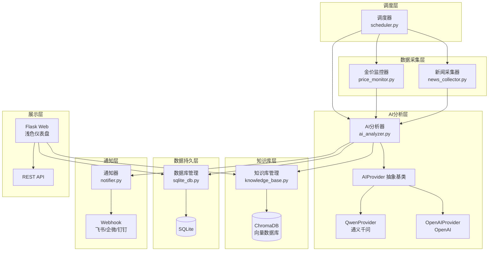
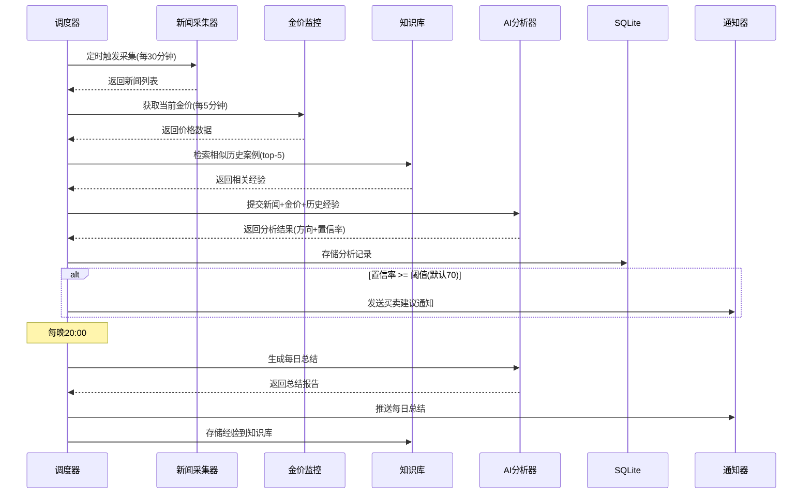

## 产品概述

一个基于 Python 的黄金市场智能监控与分析系统（Gold Monitor）。系统从多个财经新闻源自动采集信息，结合实时金价数据，通过 AI 大模型进行智能分析，生成带有置信率的买卖建议，并通过 Webhook 通知用户。系统具备知识库学习能力，可根据用户反馈持续优化判断准确性。提供浅色主题的 Web 仪表盘供用户查看实时数据、历史分析和系统状态，后续可接入 hellocola-gateway 网关服务。

## 核心功能

1. **多源新闻采集**：从新浪财经、金十数据等财经网站自动采集黄金相关新闻，支持 RSS 和网页爬取两种方式，多源并行采集并去重
2. **AI 智能分析（策略模式）**：对采集到的新闻进行利好/利空/中性分析，生成 0-100 置信率评分；AI 接入层采用策略模式，默认通义千问，可通过配置切换至 OpenAI 等模型
3. **实时金价监控**：从公开 API 获取实时黄金价格，计算涨跌幅和波动率，结合价格技术指标增强 AI 分析判断
4. **智能 Webhook 通知**：当置信率达到配置阈值（默认 70）时，通过 Webhook 推送买入/卖出建议，支持飞书/企业微信/钉钉格式
5. **每日定时总结（多维度分析）**：每天晚上 20:00 自动生成 24 小时内影响黄金波动的综合报告。AI 从多个维度进行总结：地缘政治、经济数据（CPI/非农/利率决议等）、美元走势、市场情绪、技术面信号，识别并提取当日关键事件（impact_level 高/中/低），回顾当日建议有效性与准确率
6. **知识库反馈学习**：接收用户对每条分析的"准确/不准确"反馈，将经验存入向量知识库（ChromaDB），后续分析时检索相似案例辅助决策。知识库按多维度标签存储（事件类型、影响方向、置信率、实际结果），便于精准检索
7. **Web 仪表盘**：浅色主题，展示实时金价、**关键事件卡片流**（标题+影响等级+原文超链接）、最新分析结果、置信率可视化、近期通知列表、历史记录与准确率统计，提供用户反馈交互入口

## 技术栈

- **语言**：Python 3.10+
- **Web 框架**：Flask（轻量级 Web 仪表盘 + REST API）
- **AI 接入**：通义千问（阿里云 DashScope API），策略模式支持切换 OpenAI 等模型
- **数据库**：SQLite（结构化数据持久化，WAL 模式支持并发读）+ ChromaDB（向量知识库，内嵌运行）
- **定时调度**：APScheduler
- **新闻采集**：requests + BeautifulSoup4（网页解析）+ feedparser（RSS 解析）
- **前端**：原生 HTML/CSS/JavaScript + Jinja2 模板，浅色主题
- **配置管理**：PyYAML + python-dotenv
- **容器化**：Docker

## 实现方案

### 整体策略

采用分层模块化架构，将系统拆分为数据采集层、AI 分析层、知识库层、通知层、调度层和展示层。各层通过明确的接口通信，核心模块通过调度器统一编排。AI 接入层使用策略模式（Strategy Pattern），定义统一的 `AIProvider` 抽象基类，不同大模型实现具体策略类，通过配置文件切换，符合开闭原则。

### 关键技术决策

1. **AI 策略模式**：`AIProvider` 抽象基类定义 `analyze_news()` 和 `generate_daily_summary()` 两个核心方法。`QwenProvider` 为默认实现，`OpenAIProvider` 为预留扩展。通过 `config.yaml` 中 `ai.provider` 字段配置切换，工厂方法根据配置实例化对应 Provider。AI 调用设置 3 次重试（指数退避）。

2. **知识库方案（多维度存储）**：ChromaDB 内嵌运行无需额外部署。每次 AI 分析前从知识库检索 top-5 相似场景作为上下文注入 prompt。知识条目按多维度结构化存储：事件类型（地缘政治/经济数据/央行政策/市场情绪等）、影响方向、置信率、实际走势结果、用户反馈。用户反馈（准确/不准确）连同分析记录一起存入知识库，形成经验积累闭环。检索时可按事件类型维度精准匹配相似历史案例。

3. **新闻采集架构**：`NewsSource` 抽象基类统一接口，每个新闻源独立实现采集器。RSS 优先策略（稳定性好），辅以网页爬取。使用 `ThreadPoolExecutor` 并行采集，设置频率限制防止被封。单源失败不影响整体流程。

4. **金价数据**：通过公开 API（Exchange Rates API / 金十数据）获取实时金价，5 分钟缓存避免频繁请求。计算短期涨跌幅和波动率作为 AI 辅助输入。API 不可用时使用最近缓存数据。

5. **置信率与通知**：AI 输出结构化 JSON 包含 direction（bullish/bearish/neutral）、confidence（0-100）、reasoning、suggested_action、key_factors、impact_level（high/medium/low）、event_category（geopolitical/economic_data/central_bank/usd_trend/market_sentiment/technical）。confidence >= 阈值（默认 70）时触发 Webhook。支持飞书/企业微信/钉钉三种消息格式。

6. **每日总结（多维度分析）**：APScheduler 每晚 20:00 触发，AI 从多个维度汇总分析当日事件：①地缘政治维度（战争/制裁/外交等）②经济数据维度（CPI/非农/PMI/GDP 等）③央行政策维度（利率决议/QE/缩表等）④美元汇率维度⑤市场情绪维度（避险/风险偏好）⑥技术面维度（关键点位/趋势）。提取当日关键事件（标注 impact_level: high/medium/low），对比建议与实际走势计算准确率，综合生成结构化报告后推送用户。

7. **Web 对接**：API 设计 RESTful 规范化（`/api/status`、`/api/analysis`、`/api/feedback`、`/api/prices`、`/api/events`），便于后续接入 hellocola-gateway 网关。`/api/events` 返回关键事件列表（含标题、原文URL、影响等级、事件类别）。

### 架构图



### 核心数据流



## 实现注意事项

1. **容错机制**：新闻采集处理网络超时/页面变更异常，单源失败不阻塞；AI 接口 3 次重试（指数退避）；金价 API 不可用使用缓存
2. **性能优化**：`ThreadPoolExecutor` 并行多源采集；ChromaDB 查询限制 top-5；SQLite WAL 模式并发读；金价 5 分钟缓存
3. **安全性**：所有 API Key 通过 `.env` 管理不硬编码；Webhook URL 同存环境变量；Web 仪表盘无敏感操作
4. **日志规范**：Python 标准 `logging` 按模块分级；关键操作（AI 分析/通知发送）INFO 级别；错误记录完整堆栈但不含 API Key
5. **代码规范**：所有注释和日志使用中文；配置 YAML 格式便于扩展

## 目录结构

```
gold-monitor/
├── main.py                      # [NEW] 应用入口。初始化所有模块，启动调度器和 Web 服务。支持命令行参数切换运行模式（完整/仅Web/仅调度）。
├── config.py                    # [NEW] 配置管理模块。加载 config.yaml 和 .env，提供全局配置单例，包含默认值和校验逻辑。
├── config.yaml                  # [NEW] 主配置文件。定义 AI 提供商、采集频率、置信率阈值、Webhook 配置、数据库路径等所有可调参数。
├── .env.example                 # [NEW] 环境变量模板。DashScope API Key、OpenAI API Key、Webhook URL 等敏感配置。
├── requirements.txt             # [NEW] 依赖清单。flask, apscheduler, requests, beautifulsoup4, feedparser, chromadb, dashscope, openai, pyyaml, python-dotenv 等。
├── Dockerfile                   # [NEW] Docker 构建文件。python:3.10-slim 基础镜像，安装依赖，暴露端口，设置 Asia/Shanghai 时区。
├── docker-compose.yml           # [NEW] Docker Compose 编排。定义 gold-monitor 服务，挂载数据卷持久化 SQLite 和 ChromaDB 数据。
├── README.md                    # [NEW] 完整项目文档。项目介绍、Mermaid 架构流程图、本地/Docker 部署指南、配置说明、API 文档、使用教程。
├── .gitignore                   # [NEW] Git 忽略规则。.env、__pycache__、*.db、chroma_data/、data/ 等。
├── core/
│   ├── __init__.py              # [NEW] 核心模块初始化，导出所有核心类。
│   ├── ai_analyzer.py           # [NEW] AI 分析器。AIProvider 抽象基类（策略模式接口），QwenProvider（通义千问 DashScope 实现），OpenAIProvider（预留），AIAnalyzer 调度类（工厂方法根据配置创建 provider，执行新闻分析和每日总结）。
│   ├── news_collector.py        # [NEW] 新闻采集器。NewsSource 抽象基类，SinaFinanceCollector、Jin10Collector、RSSCollector 具体实现。NewsCollector 管理多源并行采集（ThreadPoolExecutor）、去重，返回 NewsItem 列表。
│   ├── price_monitor.py         # [NEW] 金价监控器。从公开 API 获取实时金价，5 分钟缓存，计算涨跌幅和波动率，支持历史价格查询。
│   ├── knowledge_base.py        # [NEW] 知识库管理。封装 ChromaDB 操作，add_experience（存储分析经验+用户反馈）和 search_similar（检索 top-5 相似案例）。
│   ├── notifier.py              # [NEW] 通知器。Webhook 通知发送，支持飞书/企业微信/钉钉消息格式，Markdown 格式化，失败重试。
│   └── scheduler.py             # [NEW] 调度器。APScheduler 编排完整流程：新闻采集(每30min)->分析->通知，金价检查(每5min)，每日总结(每晚20:00)。
├── db/
│   ├── __init__.py              # [NEW] 数据库模块初始化。
│   ├── sqlite_db.py             # [NEW] SQLite 管理。表结构定义（news_items, analysis_results, price_history, daily_summaries, user_feedback），CRUD 操作，WAL 模式，schema 版本管理。
│   └── chroma_db.py             # [NEW] ChromaDB 封装。客户端初始化、集合管理、文档嵌入存储和相似度查询。
├── models/
│   ├── __init__.py              # [NEW] 模型模块初始化。
│   └── schemas.py               # [NEW] 核心数据结构。dataclass 定义 NewsItem, AnalysisResult, PriceData, DailySummary, UserFeedback。
├── web/
│   ├── __init__.py              # [NEW] Web 模块初始化。
│   ├── app.py                   # [NEW] Flask 应用。路由：仪表盘(/)、历史记录(/history)、API(/api/status, /api/analysis, /api/prices, /api/events, /api/feedback)。CORS 支持。
│   └── templates/
│       ├── base.html            # [NEW] 基础模板。浅色主题页面骨架，导航栏（品牌标识+系统状态），页脚，CSS/JS 资源引入。
│       ├── dashboard.html       # [NEW] 仪表盘。实时金价卡片、**关键事件卡片流**（标题超链接+影响等级+事件类别）、AI 分析结果（置信率可视化）、近期通知列表、用户反馈按钮。
│       └── history.html         # [NEW] 历史记录。日期筛选、每日总结卡片列表、历史分析表格（可排序）、准确率统计。
├── static/
│   ├── css/
│   │   └── style.css            # [NEW] 全局样式。浅色主题（白色背景+金色强调），卡片阴影，响应式布局，数据可视化样式。
│   └── js/
│       └── app.js               # [NEW] 前端交互。轮询刷新数据、用户反馈提交、图表渲染、日期筛选、排序功能。
└── tests/
    ├── __init__.py              # [NEW] 测试模块初始化。
    └── test_core.py             # [NEW] 核心模块单元测试。覆盖 AI 策略切换、新闻采集解析、知识库检索、通知发送等关键逻辑。
```

## 关键代码结构

### AI Provider 策略模式接口

```python
from abc import ABC, abstractmethod
from dataclasses import dataclass
from typing import List, Optional

@dataclass
class AnalysisResult:
    """AI 分析结果"""
    direction: str          # "bullish"(利好) / "bearish"(利空) / "neutral"(中性)
    confidence: float       # 置信率 0-100
    reasoning: str          # 分析理由
    suggested_action: str   # "buy" / "sell" / "hold"
    key_factors: List[str]  # 关键影响因素
    impact_level: str       # "high" / "medium" / "low" 事件影响等级
    event_category: str     # 事件类别：geopolitical/economic_data/central_bank/usd_trend/market_sentiment/technical

class AIProvider(ABC):
    """AI 提供商抽象基类（策略模式）"""

    @abstractmethod
    def analyze_news(
        self,
        news_items: List['NewsItem'],
        price_data: Optional['PriceData'] = None,
        historical_context: Optional[List[str]] = None
    ) -> AnalysisResult: ...

    @abstractmethod
    def generate_daily_summary(
        self,
        analyses: List[AnalysisResult],
        price_changes: List['PriceData'],
        news_items: List['NewsItem']
    ) -> 'DailySummary': ...

class QwenProvider(AIProvider):
    """通义千问实现（DashScope API）"""
    ...

class OpenAIProvider(AIProvider):
    """OpenAI 实现（预留扩展）"""
    ...
```

### 新闻采集器接口

```python
class NewsSource(ABC):
    """新闻源抽象基类"""

    @abstractmethod
    def fetch(self) -> List['NewsItem']: ...

    @abstractmethod
    def get_source_name(self) -> str: ...

@dataclass
class NewsItem:
    """新闻数据项"""
    title: str
    content: str
    source: str
    url: str
    published_at: datetime
    keywords: List[str]
```

## 设计风格

采用浅色现代金融仪表盘设计，以白色/浅灰为主背景，金色作为品牌强调色呼应黄金主题。整体风格干净、专业、现代，卡片式布局组织信息，微妙阴影营造层次感，数据可视化突出关键指标。

## 页面规划

### 页面一：仪表盘首页 (dashboard.html)

**顶部导航栏**：白色背景导航栏，底部 1px 浅灰分割线。左侧金色渐变 "Gold Monitor" 品牌标识，右侧系统状态指示灯（绿色圆点=正常）和最后更新时间，字体浅灰色。

**实时金价卡片区**：页面上部横向排列 3 个白色卡片，圆角 12px，box-shadow 0 2px 8px rgba(0,0,0,0.06)。当前金价（大号金色数字，带美元符号）、24 小时涨跌幅（绿涨红跌带箭头图标）、波动率指标（百分比数字）。悬停卡片微微上移 2px 并加深阴影。

**关键事件卡片流**：金价卡片下方，以横向可滚动的卡片流形式展示近期被 AI 判定为较大可能影响金价的关键事件。每张事件卡片为白色圆角卡片，左侧竖线颜色标识影响方向（利好绿/利空红/中性灰），卡片内显示：事件标题（加粗，1-2行截断）、影响等级标签（high 红色/medium 橙色/low 灰色圆角小标签）、事件类别标签（如"地缘政治""经济数据"等浅色背景标签）、简要一句话摘要、来源时间。标题为超链接，点击可跳转到原文页面（target="_blank"）。卡片悬停有微上移+阴影加深动效。

**AI 分析结果区**：居中大卡片展示最新分析。方向指示徽章（利好绿色/利空红色/中性灰色圆角标签）、置信率环形进度条（金色渐变填充，中心大号数字）、建议操作按钮样式标签（买入绿/卖出红/持有灰）、分析理由可折叠面板（浅灰背景）。

**近期通知列表**：白色卡片内表格布局，表头浅灰背景。每行显示时间戳、方向标签（彩色圆角小标签）、置信率进度条、简要描述。交替行浅灰底色，悬停行高亮。

**用户反馈区**：每条分析记录旁显示"准确"（绿色边框按钮）和"不准确"（红色边框按钮），点击后按钮变实心表示已提交。

### 页面二：历史记录页 (history.html)

**顶部导航栏**：与首页一致，"历史记录"导航项以金色底部边框高亮。

**日期筛选栏**：白色卡片，内含日期范围选择器和快捷按钮（今日/近7天/近30天），按钮为浅灰圆角样式，选中时金色背景白字。

**每日总结卡片列表**：按日期倒序排列。白色卡片，左侧金色竖线装饰。显示日期标题、关键事件摘要（最多 3 条，前缀彩色圆点）、金价变动幅度（绿涨红跌）、AI 准确率百分比（环形小图标）、"查看详情"展开按钮。

**历史分析表格**：白色卡片内可滚动表格，列：时间、新闻标题（截断显示）、分析方向（彩色标签）、置信率（进度条）、建议操作、用户反馈状态。表头可点击排序，排序列显示箭头图标。

**准确率统计区**：底部 2-3 个统计卡片横向排列。总体准确率（大号数字+环形图）、近 7 天准确率、各方向准确率分布。数字使用金色强调。

## Agent Extensions

### SubAgent

- **code-explorer**
- 用途：在实现过程中验证各模块间接口一致性、导入路径正确性，以及跨文件搜索确认模式复用
- 预期结果：确保策略模式接口定义、数据模型引用、模块间依赖关系的一致性和正确性