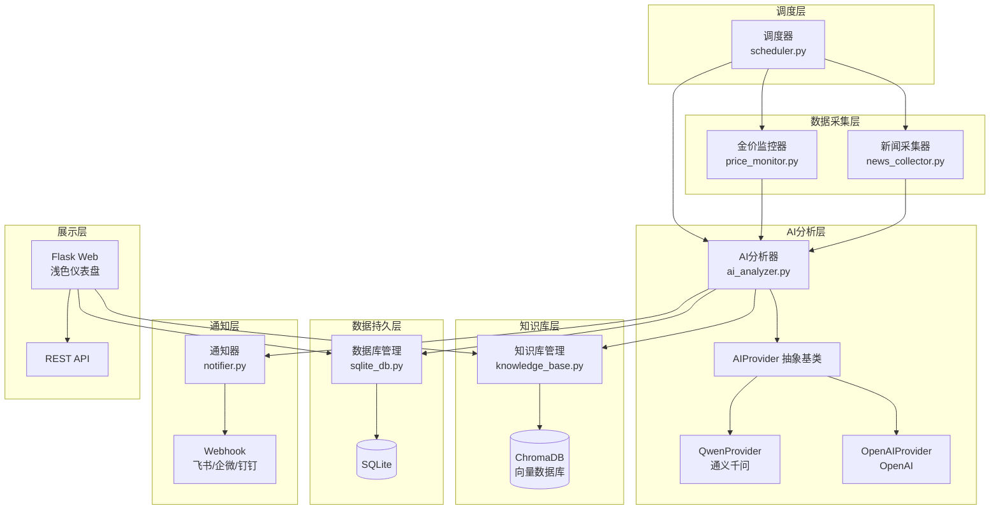
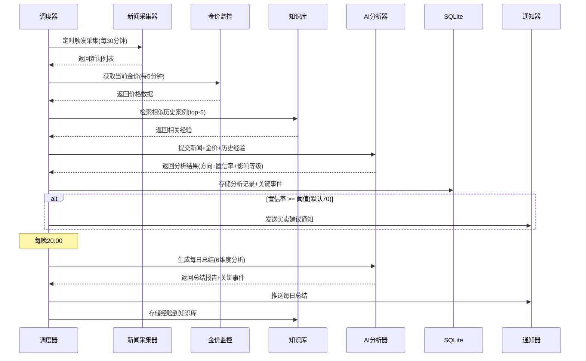

# ⚜️ Gold Monitor - 黄金智能盯盘系统

一个基于 Python 的黄金市场智能监控与分析系统。系统从多个财经新闻源自动采集信息，结合实时金价数据，通过 AI 大模型进行多维度智能分析，生成带有置信率的买卖建议，并通过 Webhook 通知用户。具备知识库学习能力，可根据用户反馈持续优化判断准确性。

## ✨ 核心功能

- **多源新闻采集** — 从新浪财经、金十数据、RSS 等多个财经新闻源并行采集黄金相关新闻
- **AI 智能分析（策略模式）** — 对新闻进行利好/利空/中性分析，生成 0-100 置信率；支持通义千问、OpenAI 等模型切换
- **实时金价监控** — 从公开 API 获取实时黄金价格，计算涨跌幅和波动率
- **关键事件识别** — AI 自动识别影响金价的关键事件，标注影响等级和事件类别
- **智能 Webhook 通知** — 当置信率达到阈值时推送买卖建议，支持飞书/企业微信/钉钉
- **每日多维度总结** — 每天 20:00 从地缘政治、经济数据、央行政策、美元走势、市场情绪、技术面 6 个维度生成综合报告
- **知识库反馈学习** — 用户反馈存入向量知识库（ChromaDB），后续分析时检索相似案例辅助决策
- **Web 仪表盘** — 浅色主题仪表盘，展示金价、关键事件卡片流、分析结果、历史记录与准确率统计

## 🏗️ 系统架构



## 📊 数据流程



## 📁 项目结构

```
gold-monitor/
├── main.py                 # 应用入口（支持 full/web/scheduler 三种模式）
├── config.py               # 配置管理（单例，加载 YAML + .env）
├── config.yaml             # 主配置文件
├── .env.example            # 环境变量模板
├── requirements.txt        # Python 依赖
├── Dockerfile              # Docker 构建文件
├── docker-compose.yml      # Docker Compose 编排
├── core/
│   ├── ai_analyzer.py      # AI 分析器（策略模式：QwenProvider / OpenAIProvider）
│   ├── news_collector.py   # 多源新闻采集器（新浪财经/金十数据/RSS）
│   ├── price_monitor.py    # 金价监控器（多API容错/缓存/波动率）
│   ├── knowledge_base.py   # 知识库管理（多维度存储/相似案例检索）
│   ├── notifier.py         # Webhook 通知器（飞书/企微/钉钉）
│   └── scheduler.py        # APScheduler 调度器
├── db/
│   ├── sqlite_db.py        # SQLite 数据库管理（WAL 模式）
│   └── chroma_db.py        # ChromaDB 向量数据库封装
├── models/
│   └── schemas.py          # 核心数据结构（NewsItem/AnalysisResult/PriceData 等）
├── web/
│   ├── app.py              # Flask 应用（路由 + REST API）
│   └── templates/          # Jinja2 页面模板
│       ├── base.html       # 基础模板
│       ├── dashboard.html  # 仪表盘
│       └── history.html    # 历史记录
├── static/
│   ├── css/style.css       # 浅色主题样式
│   └── js/app.js           # 前端交互逻辑
└── tests/
    └── test_core.py        # 核心模块单元测试
```

## 🚀 快速开始

### 环境要求

- Python 3.10+
- pip

### 本地部署

```bash
# 1. 克隆项目
git clone <repo-url>
cd gold-monitor

# 2. 创建虚拟环境
python -m venv venv
source venv/bin/activate  # macOS/Linux
# venv\Scripts\activate   # Windows

# 3. 安装依赖
pip install -r requirements.txt

# 4. 配置环境变量
cp .env.example .env
# 编辑 .env，填入你的 API Key 和 Webhook URL

# 5. 启动（完整模式：Web + 调度器）
python main.py --mode full

# 或者仅启动 Web 仪表盘
python main.py --mode web

# 或者仅启动调度器（无界面）
python main.py --mode scheduler
```

访问 `http://localhost:5051` 查看仪表盘。

### Docker 部署

```bash
# 1. 配置环境变量
cp .env.example .env
# 编辑 .env 填入配置

# 2. 构建并启动
docker-compose up -d

# 查看日志
docker-compose logs -f

# 停止
docker-compose down
```

### 运行测试

```bash
python -m pytest tests/ -v
# 或者
python -m unittest discover tests -v
```

## ⚙️ 配置说明

### 环境变量（.env）

| 变量名 | 说明 | 必填 |
|--------|------|------|
| `DASHSCOPE_API_KEY` | 通义千问 API Key | 使用千问时必填 |
| `OPENAI_API_KEY` | OpenAI API Key | 使用 OpenAI 时必填 |
| `OPENAI_BASE_URL` | OpenAI API 地址 | 可选 |
| `FEISHU_WEBHOOK_URL` | 飞书 Webhook 地址 | 按需 |
| `WECOM_WEBHOOK_URL` | 企业微信 Webhook 地址 | 按需 |
| `DINGTALK_WEBHOOK_URL` | 钉钉 Webhook 地址 | 按需 |

### 主配置（config.yaml）

```yaml
ai:
  provider: qwen          # AI 提供商: qwen / openai
  qwen_model: qwen-turbo  # 千问模型
  openai_model: gpt-4o-mini

collector:
  interval_minutes: 30     # 采集间隔
  enabled_sources:         # 启用的新闻源
    - sina_finance
    - jin10
    - rss_gold

analysis:
  confidence_threshold: 70 # 触发通知的最低置信率

daily_summary:
  hour: 20                 # 每日总结时间
  minute: 0

web:
  port: 5000
```

完整配置项请参考 `config.yaml` 文件中的注释。

## 📡 REST API

所有 API 返回统一格式：`{"success": bool, "data": {...}}`

| 方法 | 路径 | 说明 |
|------|------|------|
| GET | `/api/status` | 系统状态（运行时间、AI 提供商、知识库统计） |
| GET | `/api/prices` | 金价数据（当前价格、24h 历史） |
| GET | `/api/analysis?hours=24&limit=20` | 分析结果列表（含反馈状态） |
| GET | `/api/events?hours=48&limit=20` | 关键事件列表（含原文链接） |
| POST | `/api/feedback` | 提交用户反馈（`{analysis_id, is_accurate, comment?}`） |
| GET | `/api/summaries?days=30` | 每日总结列表 |
| GET | `/api/stats?days=7` | 准确率统计（总体/按方向） |

## 🤖 AI 策略模式

系统采用策略模式（Strategy Pattern）设计 AI 接入层，便于切换不同的大模型：

```
AIProvider (抽象基类)
├── QwenProvider    — 通义千问（DashScope API）[默认]
└── OpenAIProvider  — OpenAI 兼容 API（预留扩展）
```

**切换方式**：修改 `config.yaml` 中的 `ai.provider` 字段，或通过代码调用 `analyzer.switch_provider('openai')` 动态切换。

**扩展新模型**：继承 `AIProvider` 基类，实现 `analyze_news()` 和 `generate_daily_summary()` 两个方法，然后在 `AIAnalyzer.PROVIDER_MAP` 中注册即可。

## 📐 多维度分析

每日总结从以下 6 个维度进行深度分析：

| 维度 | 关注点 |
|------|--------|
| 🌍 地缘政治 | 战争、制裁、外交冲突等 |
| 📊 经济数据 | CPI、非农就业、PMI、GDP 等 |
| 🏦 央行政策 | 利率决议、QE/缩表、政策声明 |
| 💵 美元走势 | 美元指数变动、汇率波动 |
| 📈 市场情绪 | 避险/风险偏好、资金流向 |
| 📐 技术面 | 关键支撑/阻力位、趋势信号 |

## 🔄 与 hellocola-gateway 集成

本项目的 Web 服务可以作为独立服务注册到 [hellocola-gateway](https://github.com/hellocola/hellocola-gateway) 网关中：

1. 启动 Gold Monitor Web 服务
2. 通过 gateway 的服务注册 API 注册：

```bash
curl -X POST http://gateway:3000/api/services \
  -H "Content-Type: application/json" \
  -d '{
    "domain": "gold.hellocola.cloud",
    "target": "http://gold-monitor:5000",
    "name": "Gold Monitor"
  }'
```

3. 通过 `gold.hellocola.cloud` 访问仪表盘

## 📋 技术栈

| 分类 | 技术 |
|------|------|
| 语言 | Python 3.10+ |
| Web 框架 | Flask 3.0 |
| AI 接入 | 通义千问（DashScope）/ OpenAI |
| 结构化数据 | SQLite（WAL 模式） |
| 向量数据库 | ChromaDB（内嵌运行） |
| 定时调度 | APScheduler |
| 新闻采集 | requests + BeautifulSoup4 + feedparser |
| 前端 | HTML + Tailwind CSS + Vanilla JS |
| 容器化 | Docker + Docker Compose |

## 📄 License

MIT License
